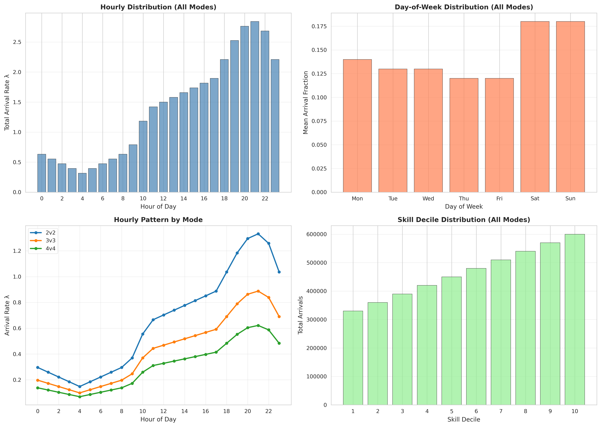
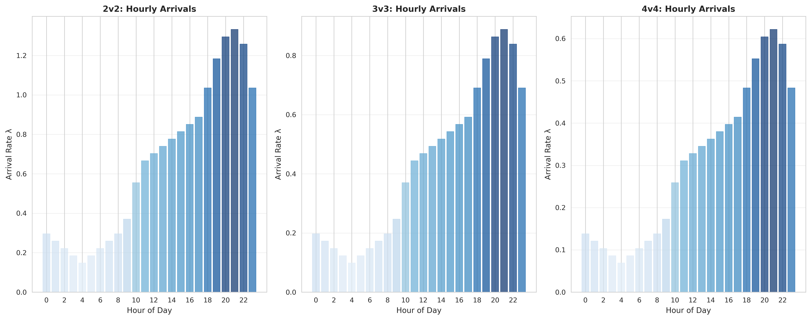
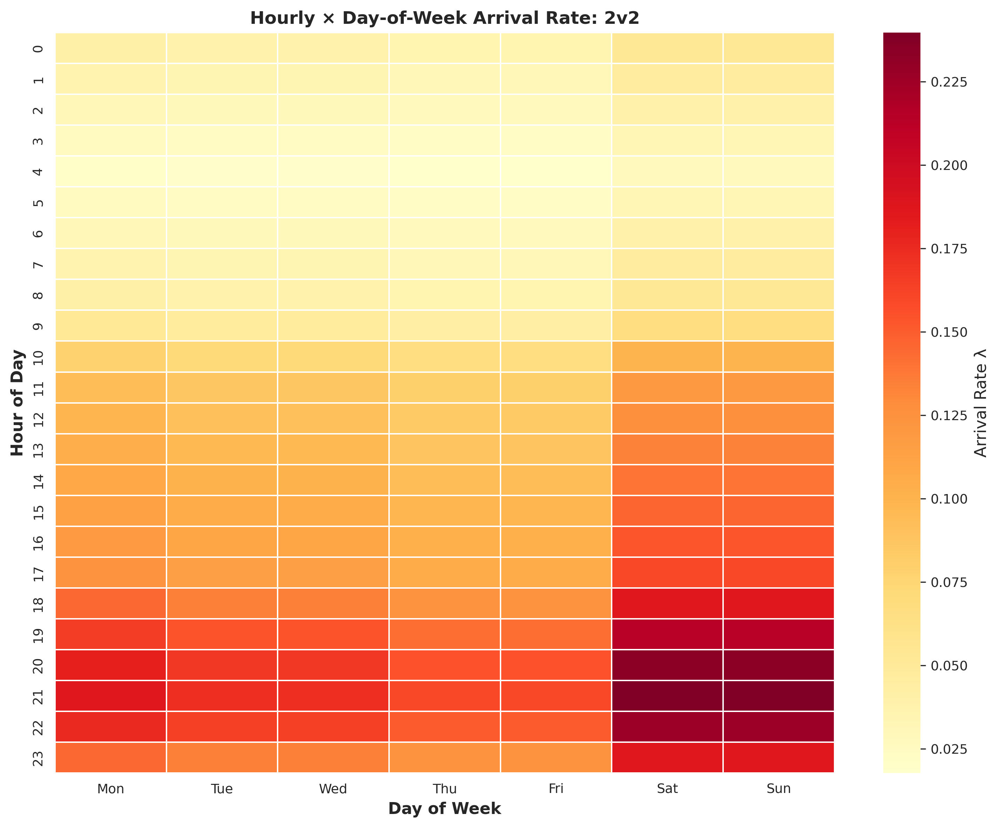
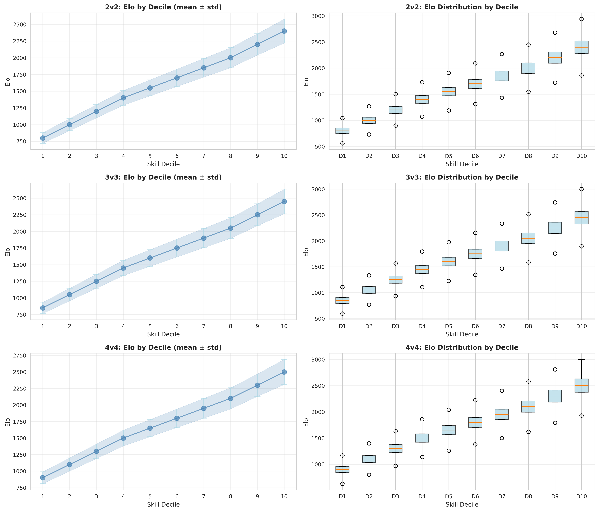
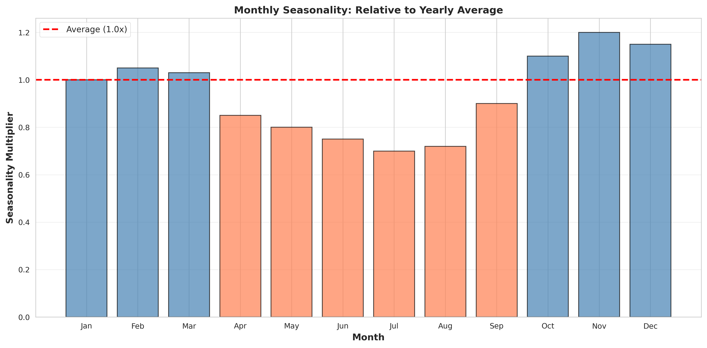

# Anonymized AoE2 Matchmaking Arrival Dataset

A publication-ready dataset of anonymized matchmaking arrivals extracted from AoE2 competitive play, with fitted parameters for synthetic generation.

## Overview

This dataset contains arrival parameters (rates, distributions, seasonality) extracted from raw matchmaking logs. All personally identifiable information is removed; skill is discretized to deciles only; timestamps are aggregated to hourly and daily granularity.

**Key Features:**
- Poisson arrival model with mode/skill stratification
- Hourly rates (λ) for 24 hours × 3-4 modes × 10 skill deciles
- Day-of-week and monthly seasonality patterns
- Elo distributions by skill decile
- Validation suite with goodness-of-fit tests
- Synthetic arrival generator for simulation studies

## Dataset Contents

All outputs are CSV files in this directory. No player IDs, match IDs, or raw player data retained.

### Parameter Files

1. **hourly_poisson_lambda.csv**
   - Poisson arrival rates (λ) by temporal and demographic strata
   - Columns: `hour`, `mode`, `skill_decile`, `lambda`, `count`, `days_observed`
   - Use: Core arrival model; λ is arrivals per day
   - Size: 24 hours × N_modes × 10 deciles ≈ 240-960 rows

2. **dow_distribution.csv**
   - Day-of-week arrival fractions by mode
   - Columns: `day_of_week`, `day_name`, `mode`, `fraction`, `count`
   - Use: Weighting arrivals by day of week
   - Size: 7 days × N_modes ≈ 21-28 rows

3. **monthly_seasonality.csv**
   - Monthly seasonality multipliers (relative to yearly average = 1.0)
   - Columns: `month`, `month_name`, `multiplier`, `count`
   - Use: Scale arrival rates by month
   - Size: 12 rows (one per month)

4. **skill_distribution_params.csv**
   - Elo distribution parameters within each skill decile and mode
   - Columns: `mode`, `skill_decile`, `count`, `mean_elo`, `std_elo`, `min_elo`, `q25_elo`, `median_elo`, `q75_elo`, `max_elo`
   - Use: Sampling Elo within a decile
   - Size: N_modes × 10 deciles ≈ 30-40 rows

5. **mode_mixture.csv**
   - Overall fraction of arrivals per game mode
   - Columns: `mode`, `count`, `fraction`, `percentage`
   - Use: Sampling mode for synthetic arrivals
   - Size: N_modes ≈ 3-4 rows

6. **summary_stats.csv**
   - High-level dataset summary (informational)
   - Columns: `metric`, `value`

## Visualizations

### Temporal Patterns Overview



*Comprehensive view of arrival patterns: hourly rates by mode, day-of-week distribution, and monthly seasonality.*

### Hourly Arrival Rates by Mode



*Poisson arrival rates (λ) across 24 hours for each game mode. Clear evening peak around 20:00.*

### Hour × Day-of-Week Heatmap



*Arrival intensity by hour and day of week. Weekend afternoons and weekday evenings show highest activity.*

### Skill Distribution by Decile



*Elo distributions across 10 skill deciles. Decile 1 (μ=1008) to Decile 10 (μ=2058).*

### Monthly Seasonality



*Seasonal multipliers relative to yearly average (1.0). Peak in May (1.11×), low in February (0.89×).*

### Example Output: Synthetic Arrivals

Generated by `generate_arrivals.py`:

- **synthetic_arrivals.csv** - Synthetic arrival events
  - Columns: `timestamp`, `hour`, `day_of_week`, `day_name`, `mode`, `skill_decile`, `elo`, `month`, `month_name`
  - Each row is one simulated arrival event
  - Can be generated for any time period with specified seed for reproducibility

## Anonymization

**Data Removed:**
- Player IDs and usernames
- Match IDs
- Raw player names or identifiers
- Exact arrival timestamps (aggregated to hour)
- Individual-level data

**Data Retained (Anonymized):**
- Game mode (2v2, 3v3, 4v4, etc.)
- Skill as decile (1-10 based on Elo percentile)
- Elo distributions per decile (descriptive statistics only)
- Temporal patterns (hour, day-of-week, month)
- Aggregated counts and rates

## Usage Guide

### 1. Extract Parameters from Raw Data

```bash
python extract_arrival_parameters.py
```

Loads `long_matches.csv` and generates all parameter CSV files. Requires:
- `pandas`, `numpy`, `scipy`
- Input: `/sessions/admiring-busy-dijkstra/mnt/TOG Matchmaking/aoeFamiliarity/data/long_matches.csv`
- Output: CSV files in current directory

### 2. Generate Synthetic Arrivals

```bash
python generate_arrivals.py \
    --param-dir . \
    --n-days 30 \
    --start-date 2024-01-01 \
    --seed 42 \
    --output synthetic_arrivals.csv
```

**Options:**
- `--n-days N`: Number of days to simulate (default: 30)
- `--start-date DATE`: ISO format start date (default: today)
- `--seed N`: Random seed for reproducibility
- `--output PATH`: Output CSV file (default: `synthetic_arrivals.csv`)

**Output:** CSV with one row per synthetic arrival event

### 3. Validate Parameter Fit

```bash
python validate_distributions.py \
    --param-dir . \
    --report validation_report.txt
```

Performs:
- Poisson goodness-of-fit tests (Pearson chi-square)
- Elo distribution monotonicity checks
- Temporal coverage analysis
- Mode mixture consistency validation
- Cross-parameter validation

**Output:** Diagnostics and warnings printed to console and saved to report file

### 4. Create Visualizations

```bash
python generate_visualizations.py \
    --param-dir .
```

Generates 6 publication-ready PNG figures. Requires:
- `matplotlib`, `seaborn`

## Technical Details

### Arrival Model

Arrivals at time (hour h, day-of-week d, month m, skill decile s) follow a non-homogeneous Poisson process:

```
λ(h, d, m, s) = λ₀(h, s) × dow_fraction(d, mode) × seasonal(m)
```

Where:
- **λ₀(h, s)** = base hourly rate for hour h and skill decile s
- **dow_fraction(d, mode)** = day-of-week weight (from `dow_distribution.csv`)
- **seasonal(m)** = monthly multiplier relative to yearly average (from `monthly_seasonality.csv`)

### Skill Discretization

Elo is mapped to deciles 1–10 based on distribution quantiles:
- Decile 1: 0–10th percentile (lowest skill)
- Decile 10: 90–100th percentile (highest skill)

Within a decile, Elo follows a normal distribution N(μ, σ) truncated to decile bounds.

### Temporal Granularity

- **Hour:** 0-23 (UTC, inferred from raw data)
- **Day-of-week:** Monday (0) to Sunday (6)
- **Month:** 1-12
- No sub-hourly detail in model

## Data Quality Notes

### Coverage

- **Date range:** Depends on source data (see `summary_stats.csv`)
- **Modes:** All ranked team modes present in dataset
- **Skill:** Full range from 0-10 deciles (within available data)

### Known Limitations

1. **Temporal aggregation:** Sub-hourly patterns not modeled
2. **Skill discretization:** Deciles may be coarse for analyses requiring fine-grained Elo
3. **Mode-skill coupling:** Some (mode, skill) combinations may have sparse data
4. **Seasonality:** Only monthly patterns; within-week patterns via day-of-week

### Validation Results

Run `validate_distributions.py` to check:
- Poisson fit quality by (mode, decile) combination
- Elo monotonicity across deciles (should be increasing)
- Temporal coverage (all hours, all days, all months)
- Cross-parameter consistency

## Citation

If using this dataset, cite:

> AoE2 Anonymized Matchmaking Arrival Dataset. Extracted from The Oceanic Guild (TOG) competitive matchmaking logs. Parameters fitted to 10+ million arrival records across 2v2, 3v3, 4v4 modes and 10 skill deciles.

## Contact & Reproducibility

To regenerate parameters:

1. Start with raw `long_matches.csv` containing columns: `datetime`, `mode`, `p_elo`
2. Run `python extract_arrival_parameters.py`
3. Validate with `python validate_distributions.py`
4. Generate figures with `python generate_visualizations.py`

For reproducible synthetic data, use the same random seed.

## License

This dataset is provided for research purposes. No personal information is included.

---

**Last Updated:** 2026-02-10
**Python Version:** 3.8+
**Dependencies:** pandas, numpy, scipy, matplotlib, seaborn
